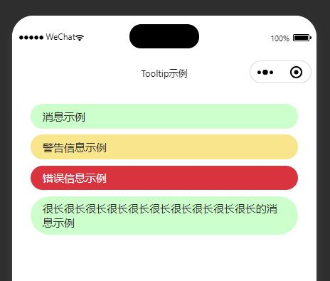

# WeChat Mini Program Tooltip

微信小程序中使用的顶部消息提示组件

## 效果预览



## 安装

1. `npm i wechat-mp-tooltip`
2. 微信开发者工具菜单栏 -> 工具(Tools) -> 构建NPM(build NPM)
3. 若组件引用出现异常, 可能需要重启一下开发者工具, 此非本组件之bug

更多关于微信小程序中使用npm包的信息请参考[微信小程序官方文档](https://developers.weixin.qq.com/miniprogram/dev/devtools/npm.html)

## 使用示例

由于此组件通常作为全局组件使用, **强烈建议**将组件定义于`app.json`中, 如:

_app.json_

```json
{
  "usingComponents": {
    "tooltip": "wechat-mp-tooltip"
  }
}
```

如果确实仅在特定页面使用本组件, 可以仅在页面对应的json配置文件中配置, 内容同上.

然后, 需要在各页面的wxml结构中, 加入

_page.wxml_

```xml
<tooltip id="tooltip" />    <!-- 如果采用默认配置(见下文), 此处的 id="tooltip" 不可省略 -->
```

> 目前受限于微信未提供使用代码动态向页面添加组件的方式, 只能于各页面分别定义一个tooltip标签. 若之后有更好的实现方法将立刻改进.

最后, 在页面代码中使用组件方法显示消息

_page.js_

```javascript
Tooltip.info('简易消息示例');
```

或

```javascript
Tooltip.info('丰富消息示例', 2000, {
    componentId: 'custom-tooltip-id',
    componentFetcher: () => { /* Fetch the tooltip component */ }
});
```

## API详述

组件对外提供一个核心类`Tooltip`以及配置项类型`TooltipOptions`和组件类型`TooltipComponent`.

### Tooltip

##### 静态属性

`defaultOptions`: 默认配置项, 显示消息时若未显式指定配置项, 将使用此设定. 具体配置值见下文 _配置项类型_

> 需修改默认配置时, 可于小程序初始化阶段修改`Tooltip.defaultOptions`里的属性. 修改将对全局生效

##### 静态方法

`Tooltip`共包含三个静态方法`info()`, `warning()`, `error()`, 分别对应通知信息、警告信息及错误信息. 三个方法拥有完全一致的参数签名, 分别依次为

`message: string`: 待显示的消息内容  
`duration: number`: 消息显示的时间, 默认为5000ms (5S)  
`opts: TooltipOptions`: 消息配置项, 默认使用`Tooltip.defaultOptions`  

### TooltipOptions

`componentId: string`: 默认情况下(无自定义componentFetcher), 将在当前显示的页面上通过id查找tooltip组件, 默认值为`tooltip`, 因此wxml中需为组件添加`id="tooltip"`. 如果与现有组件id冲突, 可自行设定此值  
`componentFetcher: () => TooltipComponent | null`: 获取tooltip组件的方法, 默认在当前显示的页面上通过id查找tooltip组件. 如果返回`null`, 消息将不被显示  

### TooltipComponent

即`WechatMiniprogram.Component.Instance`, 代表tooltip的组件类型, 仅用于`TooltipOptions#componentFetcher`的返回值.